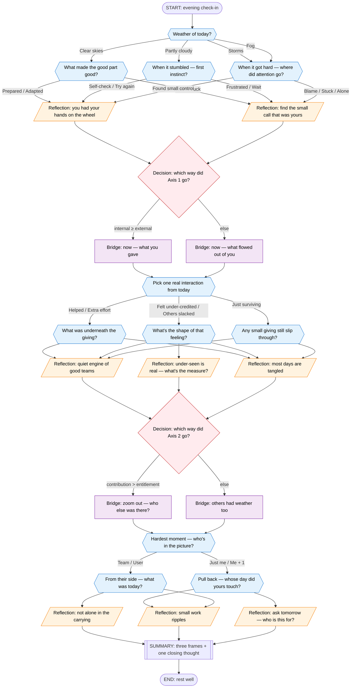

# The Tree — Visual Map

I kept going back and forth on whether to include this diagram, because the JSON file is already the source of truth. But when I tried to explain my own tree to a friend verbally, I realized a picture saves a lot of words. So — here.

## How to read this

- **Blue diamonds** = questions (person picks one)
- **Orange** = reflections (person reads, presses continue)
- **Purple** = bridges (short transitions between axes)
- **Red diamonds** = decisions (invisible to the person — just routing based on their earlier picks)
- **Rounded** = start / end

## The three axes, again

| # | Axis | The spectrum | Section |
|---|---|---|---|
| 1 | Locus | Victim ↔ Victor | `A1_*` |
| 2 | Orientation | Entitlement ↔ Contribution | `A2_*` |
| 3 | Radius | Self-centric ↔ Altrocentric | `A3_*` |
